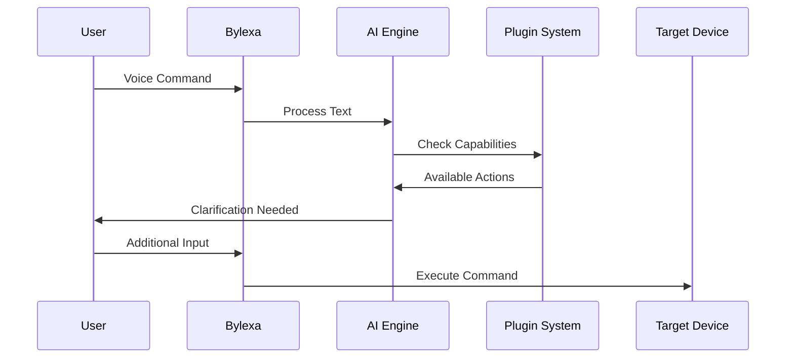

Here's a step-by-step approach to implement your vision for Bylexa:

### Phase 1: Agentic AI System
1. **Natural Language Understanding Pipeline**
```python
class IntentParser:
    def __init__(self):
        self.nlp_model = load_core_model()
        self.command_registry = CommandRegistry()
        
    def parse_command(self, text: str) -> Dict:
        # Analyze text with multiple models
        intent = self.nlp_model.predict(text)
        commands = self._match_commands(intent)
        
        if len(commands) > 1:
            return {"status": "ambiguous", "options": commands}
        return {"status": "clear", "command": commands[0]}
```

2. **Dialog Management System**
```python
class DialogManager:
    def handle_response(self, user_input: str, context: Dict):
        if context['state'] == 'ambiguous':
            return self._resolve_ambiguity(user_input, context)
        elif context['state'] == 'missing_params':
            return self._collect_parameters(user_input, context)
```

3. **AI Orchestration Layer**
```python
class AIOrchestrator:
    def execute_voice_command(self, text: str):
        # Step 1: Initial parsing
        intent = self.parser.parse_command(text)
        
        # Step 2: Handle ambiguity
        if intent['status'] == 'ambiguous':
            return self.dialog_manager.request_clarification(intent['options'])
            
        # Step 3: Execute or request parameters
        if self._validate_command(intent['command']):
            return self._execute_command(intent['command'])
        else:
            return self.dialog_manager.request_parameters(intent['command'])
```

### Phase 2: Community Platform Integration
1. **Script/Plugin Registry Service**
```python
class CommunityRegistry:
    def submit_script(self, script_data: Dict):
        # Validate script structure
        # Store in community database
        # Generate API endpoint for retrieval
        
    def search_scripts(self, query: str) -> List[Dict]:
        # Use semantic search with AI embeddings
        return self.vector_db.search(query)
```

2. **Plugin Development Kit**
```python
class XamppPlugin(PluginBase):
    @plugin_command(
        description="Start XAMPP services",
        parameters={
            "service": {"type": "str", "options": ["mysql", "apache"]}
        }
    )
    def start_service(self, params: Dict):
        # Implementation code
```

3. **Validation Sandbox**
```python
class ScriptSandbox:
    def run_untrusted_code(self, code: str):
        with restricted_env():
            exec(code, constrained_globals, constrained_locals)
```

### Phase 3: Trigger System & SDK
1. **WebSocket Gateway**
```python
class BylexaWSServer:
    async def handle_connection(self, websocket):
        async for message in websocket:
            if message.type == 'AUTH':
                await self._authenticate(message)
            elif message.type == 'COMMAND':
                await self._process_command(message)
```

2. **Developer SDK Components**
```python
class BylexaClient:
    def __init__(self, api_key: str):
        self.connection = WebSocketClient(API_ENDPOINT)
        
    def register_trigger(self, event_type: str, callback: Callable):
        self._triggers[event_type] = callback
        
    def execute_remote(self, command: Dict):
        self.connection.send(json.dumps(command))
```

### Implementation Roadmap

1. **Core AI Infrastructure (6-8 weeks)**
- Implement hybrid NLP model (rule-based + ML)
- Build dialog state machine
- Create testing framework for voice commands

2. **Community Platform (8-12 weeks)**
- Develop registry API with version control
- Create script submission portal
- Implement reputation/rating system
- Build moderation tools

3. **Plugin System Enhancements (4-6 weeks)**
- Develop plugin metadata standards
- Create plugin marketplace UI
- Implement dependency management

4. **SDK & Trigger System (6-8 weeks)**
- Design protocol specifications
- Build language-specific SDKs (Python/JS/Go)
- Implement permission system
- Create documentation portal

5. **Security Framework (Ongoing)**
- Implement code signing for plugins
- Add OAuth2 authentication
- Create audit logging system
- Develop automatic vulnerability scanning

### Key Architectural Decisions

1. **AI Component Design**
- Use ensemble model combining:
  - Local fast-text model for basic commands
  - Cloud-based LLM for complex parsing
  - Custom grammar for domain-specific terms

2. **Plugin Isolation**
```python
class PluginContainer:
    def __init__(self, plugin_module):
        self.sandbox = RestrictedPython()
        self.environment = self.sandbox.create_environment()
        
    def execute(self, method: str, params: Dict):
        return self.sandbox.run(
            f"plugin_module.{method}(**{params})",
            environment=self.environment
        )
```

3. **Real-time Communication**


### Recommended Tech Stack

- **AI Components**: Rasa + spaCy + Transformers
- **Plugin System**: Importlib + RestrictedPython
- **Community Backend**: FastAPI + PostgreSQL + Redis
- **SDK**: AutobahnPython (WebSocket) + Protocol Buffers
- **Security**: OAuth2 + JWT + Hashicorp Vault

This approach provides a balance between flexibility and security while enabling the community-driven ecosystem you envision. Start with the core AI infrastructure and gradually build out the community features while maintaining strict security controls.